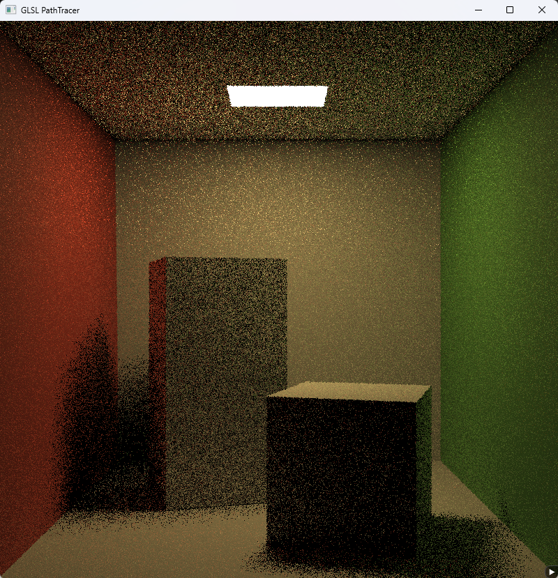
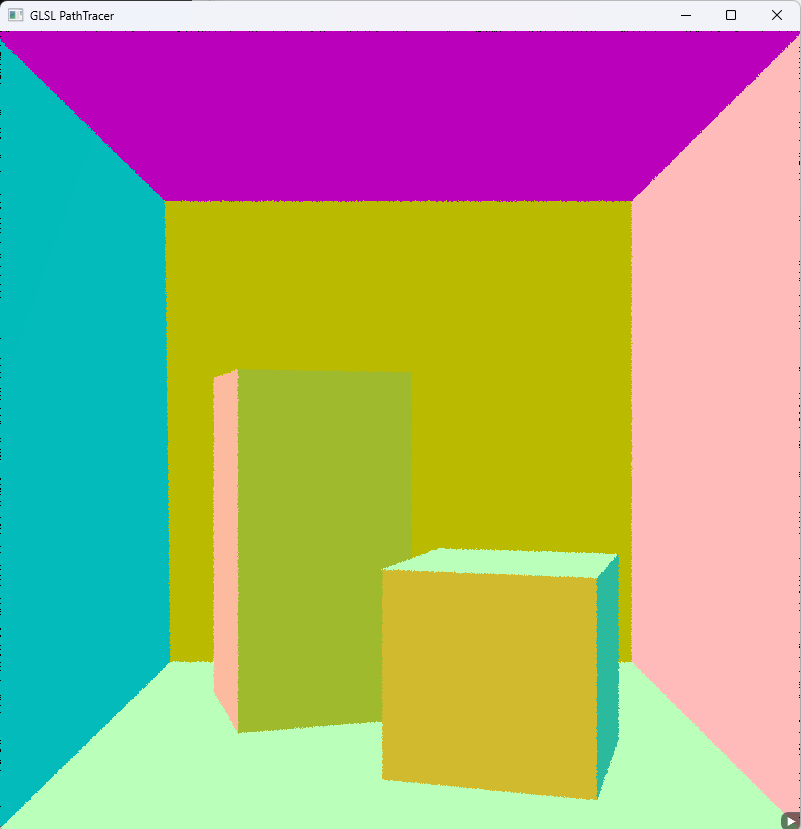
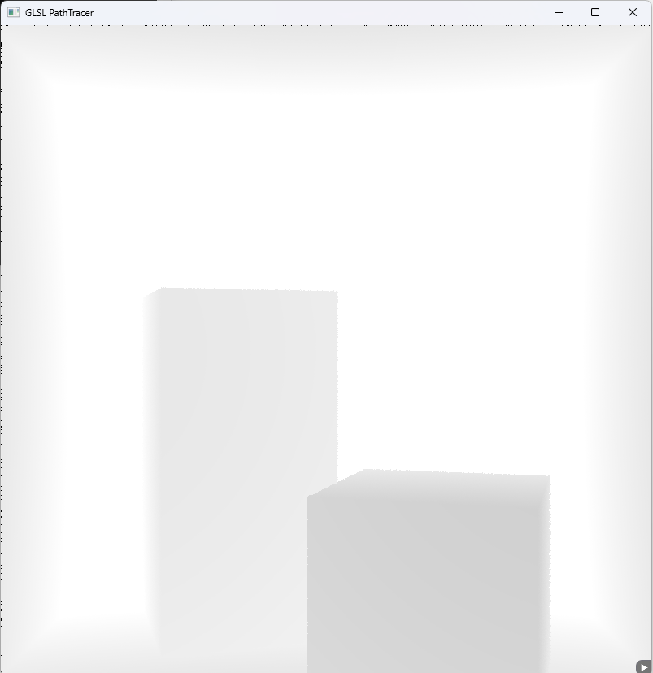
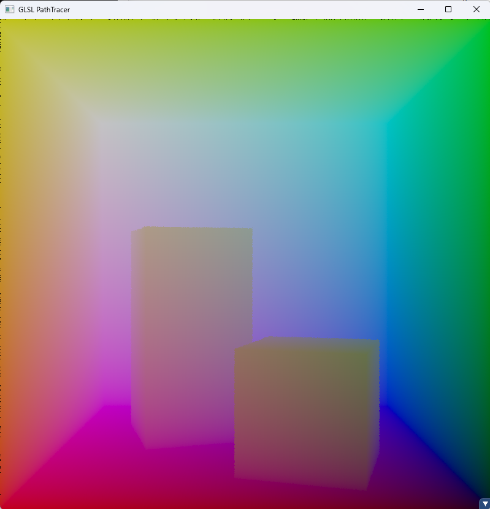
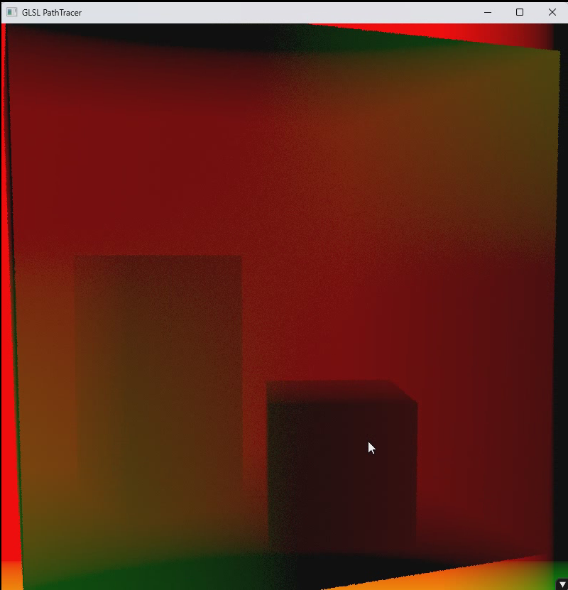
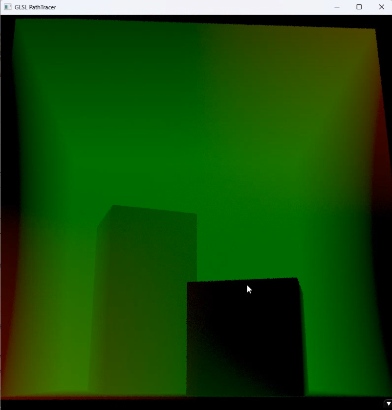
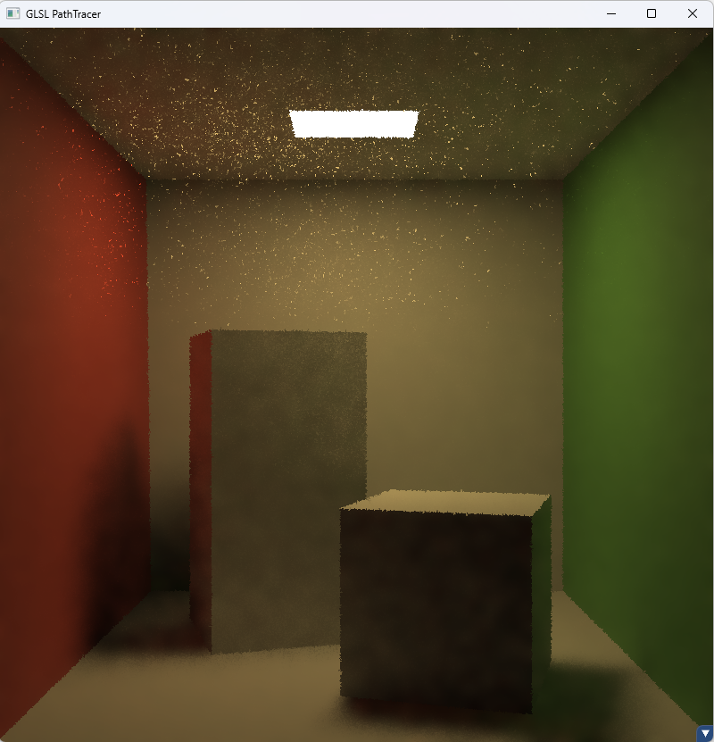
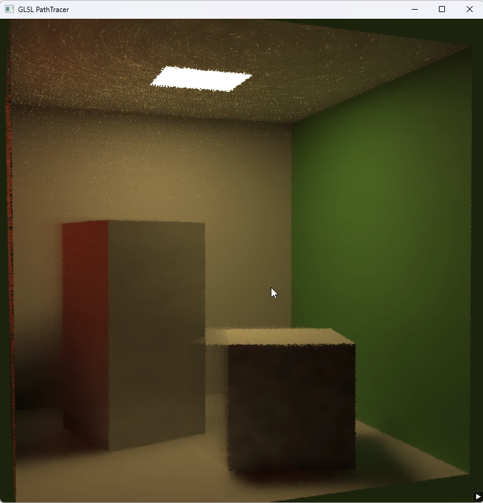
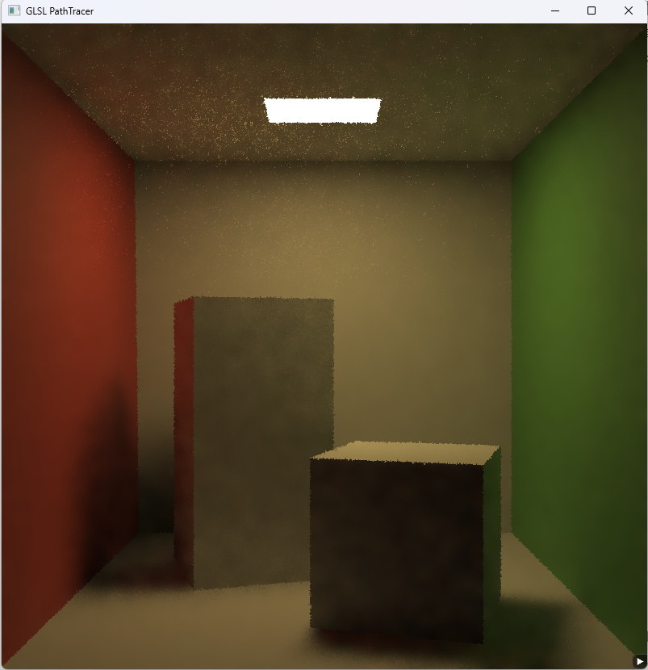

Real-Time GLSL-Based PathTracing
==========
This is a real-time ray tracing project with GPU-denoise. The general framework of the project comes from knightcrawler25/GLSL-PathTracer (https://github.com/knightcrawler25/GLSL-PathTracer) 

It's about 45 FPS when running on 3060Ti and I5-12600KF.

Features
--------
- Only 1 spp for each pixel
- Spatial filtering combining with depth, color and normal
- Temporal filtering
- Outlier remove

More Features
--------
- Two-level BVH for instancing
- SAH BVH
- Disney BSDF

Steps
--------
- 1 spp path tracing
  
- Get GBuffer
  
  normal:
  
  depth:
  
  position:
  
- Spatial filtering
  
- Motion Vector
  
  
- Temperal filtering
  
  Afterimages occur during fast motion
  
- Outlier remove
  
  Works well on simple models, but blurry on complex models.

TODO
--------
- Add svgf
- Complete the GBuffer when no hit to support IBL
- Use a more efficient filter kernel